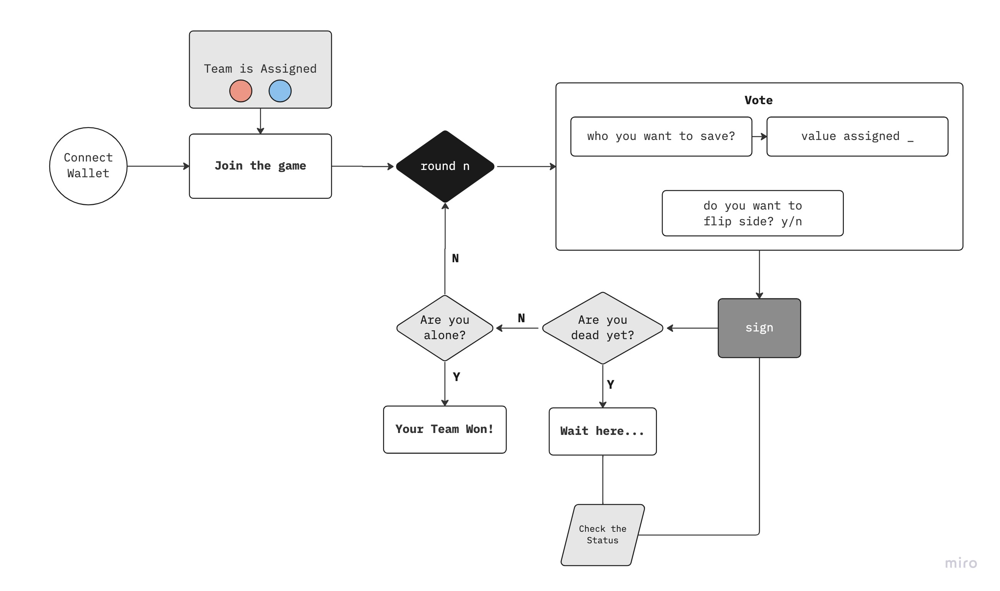

# The Censorship Game

An on-chain, hidden role game featuring quadratic voting that doesn't require zero knowledge proofs. 

Will you reveal your true colors?

## Background
The Censorship Game was built during [ETHBrno 2022](https://ethbrno.cz) hackathon with the intent to push players to reflect about _privacy_ and _security_, while learning about quadratic voting and the commit-reveal design pattern. 

It is a proof of concept for a new genre of games that allow players to have secret properties/abilities without the complexity or computational overhead of zero knowlege proofs.

## Rules 

- there are 2 teams = 2 colors
- when the game starts you get assigned a color 
  - you are the only one knowing your color
- every round you can choose which participant you want to save
- the goal of the game is to be on the winning team by any means necessary
- each round you are assigned 100 points, choose:
  - who you want to save from the list of participants
    - can’t vote for yourself 
  - there’s a limited time to vote (10min), or until every player has voted 
  - a value (points) to assign to each participant you want to save
    - keep in mind it’s quadratic voting 
  - if you want to flip side (change color) 
    - only if you’re not dead

every round the bottom half of players by votes are “redacted” (eliminated)

## How to Play

navigate to [https://censorship-game.vercel.app](https://censorship-game.vercel.app)

- type **connect** to connect your wallet to optimism network (you need ethbrno nft)
- type **join** to start the game ( a team/color is assigned)
- type **vote** to start voting
- sign the transaction to lock your choices
- type **status** to check who is winning

Video [https://www.youtube.com/watch?v=DYylnJLHSKo](https://www.youtube.com/watch?v=DYylnJLHSKo)
